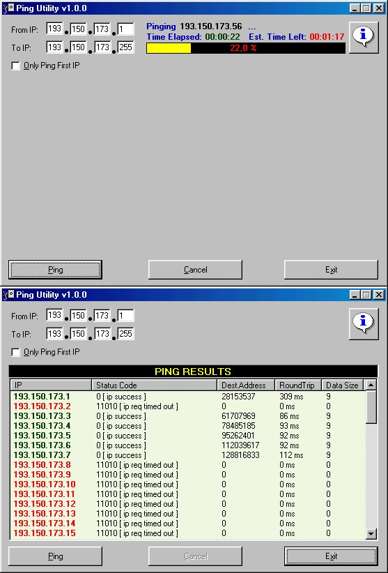



## Ping Utility

### Description

A utility that pings a given range of IP addresses and presents the results in a sortable format,within a grid.
 
### More Info
 
a range of IP adresses, for example

255.255.255.1 to 255.255.255.255

             |
---                |---
**Submitted On**   |2000-08-08 23:52:32
**By**             |[Theo Kandiliotis](https://github.com/Planet-Source-Code/PSCIndex/blob/master/ByAuthor/theo-kandiliotis.md)
**Level**          |Intermediate
**User Rating**    |4.5 (18 globes from 4 users)
**Compatibility**  |VB 5\.0, VB 6\.0
**Category**       |[Complete Applications](https://github.com/Planet-Source-Code/PSCIndex/blob/master/ByCategory/complete-applications__1-27.md)
**World**          |[Visual Basic](https://github.com/Planet-Source-Code/PSCIndex/blob/master/ByWorld/visual-basic.md)
**Archive File**   |[CODE\_UPLOAD8760882000\.zip](https://github.com/Planet-Source-Code/theo-kandiliotis-ping-utility__1-10529/archive/master.zip)

